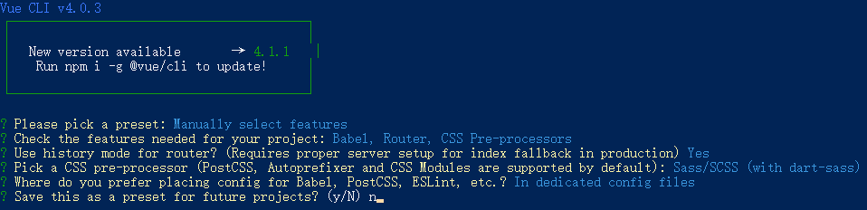

# 1.初识
## 安装

```shell
# 全局卸载
npm uninstall vue-cli -g
# 全局安装
npm install -g @vue/cli
```

## 创建项目

### 命令

```vue create project-name```

### 设置




## 工程启动
```
npm install
```

### 编译和热重装以进行开发
```
npm run serve
```

### 编译并最小化生产
```
npm run build
```

### 自定义配置
See [Configuration Reference](https://cli.vuejs.org/config/).

