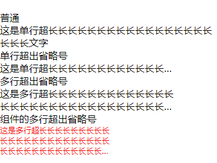

# 文字超出范围省略号显示

## 效果预览



## 主要代码

[index.wxss](index/index.wxss)

``` css
/* 单行省略号 */

.single-line {
  width: 600rpx;
  white-space: nowrap; /*强制不换行*/
  overflow-x: hidden; /*超出文字自动隐藏 */
  text-overflow: ellipsis; /*文字隐藏后添加省略号*/
}

/* 多行省略号 */

.multi-line {
  width: 600rpx;
  display: -webkit-box;
  overflow: hidden; /*超出部分隐藏*/
  text-overflow: ellipsis;
  word-wrap: break-word; /*全部换号*/
  white-space: normal !important; /*强制换行*/
  -webkit-line-clamp: 2; /*要显示行数*/
  -webkit-box-orient: vertical; /*从上向下垂直排列子元素*/
}
```

关于```text-ellipsis```组件的主要代码

[text-ellipsis.js](components/text-ellipsis/text-ellipsis.js)

```js
Component({
  externalClasses: ["outside-style"],
})
```

[text-ellipsis.wxml](components/text-ellipsis/text-ellipsis.wxml)

```html
<view class="multi-line outside-style">
  <slot>
  </slot>
</view>
```

[text-ellipsis.wxss](components/text-ellipsis/text-ellipsis.wxss)

```css
/* 这里与前面一样 */
.multi-line {
  width: 600rpx;
  display: -webkit-box;
  overflow: hidden; /*超出部分隐藏*/
  text-overflow: ellipsis;
  word-wrap: break-word; /*全部换号*/
  white-space: normal !important; /*强制换行*/
  -webkit-line-clamp: 2; /*要显示行数*/
  -webkit-box-orient: vertical; /*从上向下垂直排列子元素*/
}
```

引用组件

[index.json](index/index.json)

```json
"usingComponents": {
    "text-ellipsis":"/components/text-ellipsis/text-ellipsis"
}
```

使用

[index.wxml](index/index.wxml)

```html
<text-ellipsis outside-style="outside-style">[文字内容]</text-ellipsis>
```

[index.wxss](index/index.wxss)

```css
/* 使用外部class样式 */
.outside-style{
  width: 400rpx !important;
  color: red;
  -webkit-line-clamp: 3 !important;
  font-size: 28rpx
}
```


